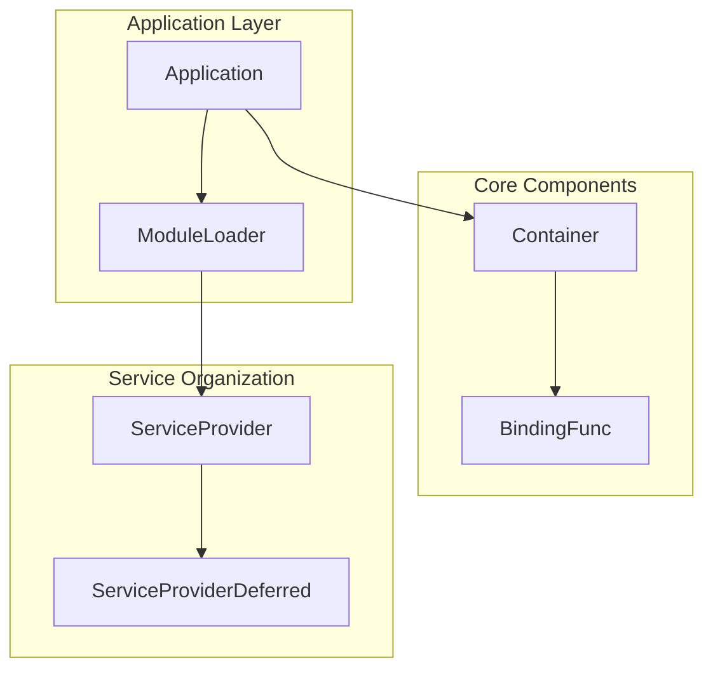

# Tài liệu Kỹ thuật - Package go-fork/di

## Tổng quan

Package `go-fork/di` cung cấp hệ thống Dependency Injection (DI) hiện đại và linh hoạt cho Go framework. Hệ thống được thiết kế theo các nguyên tắc SOLID và patterns phổ biến trong các framework lớn như Laravel và Spring Boot.

## Cấu trúc Tài liệu

### 1. [Container](container.md) 
**File nguồn:** `container.go`  
**Mô tả:** DI Container - thành phần cốt lõi quản lý toàn bộ dependencies  
**Nội dung chính:**
- Container struct và lifecycle management
- Binding operations (Bind, Singleton, Instance, Alias)
- Dependency resolution (Make, MustMake)
- Reflection-based injection (Call method)
- Container utilities (Bound, Reset)

### 2. [Application](application.md)
**File nguồn:** `application.go`  
**Mô tả:** Application interface - contract chuẩn cho ứng dụng sử dụng DI  
**Nội dung chính:**
- Application interface definition
- Service provider management
- Application lifecycle patterns
- Framework integration strategies

### 3. [ModuleLoader](loader.md)
**File nguồn:** `loader.go`  
**Mô tả:** ModuleLoaderContract - hệ thống load modules động  
**Nội dung chính:**
- Module loading mechanisms
- Dynamic provider registration
- Plugin architecture support
- Configuration-driven module management

### 4. [ServiceProvider](provider.md)
**File nguồn:** `provider.go`  
**Mô tả:** ServiceProvider interface - pattern chuẩn cho việc tổ chức services  
**Nội dung chính:**
- ServiceProvider interface và lifecycle
- Service registration và bootstrapping
- Provider dependency management
- Enterprise-level implementation patterns

### 5. [ServiceProviderDeferred](deferred.md)
**File nguồn:** `deferred.go`  
**Mô tả:** ServiceProviderDeferred interface - hỗ trợ deferred operations  
**Nội dung chính:**
- Post-request processing capabilities
- Async task management
- Resource cleanup strategies
- Background job patterns

## Kiến trúc Tổng thể



## Luồng Hoạt động Chính

### 1. Initialization Phase
1. **Container Creation**: Tạo DI container
2. **Provider Registration**: Đăng ký service providers
3. **Binding Registration**: Đăng ký bindings qua providers
4. **Bootstrap**: Khởi tạo các services

### 2. Runtime Phase
1. **Dependency Resolution**: Resolve dependencies khi cần
2. **Service Invocation**: Gọi services với auto-injection
3. **Request Processing**: Xử lý business logic

### 3. Deferred Phase (optional)
1. **Post-processing**: Thực hiện deferred operations
2. **Cleanup**: Dọn dẹp resources
3. **Background Tasks**: Xử lý async jobs

## Patterns và Best Practices

### Service Provider Pattern
- **Encapsulation**: Mỗi provider quản lý một nhóm services liên quan
- **Lifecycle Management**: Tách biệt registration và bootstrap phases
- **Dependency Declaration**: Khai báo dependencies một cách rõ ràng

### Dependency Injection Pattern
- **Constructor Injection**: Inject dependencies qua function parameters
- **Factory Pattern**: Sử dụng factory functions cho complex initialization
- **Singleton Management**: Quản lý lifecycle của singleton services

### Module Organization
- **Separation of Concerns**: Tách biệt các concerns khác nhau
- **Plugin Architecture**: Hỗ trợ dynamic loading và configuration
- **Configuration-driven**: Quản lý modules qua configuration

## Ví dụ Sử dụng Tổng hợp

```go
// 1. Khởi tạo container
container := di.New()

// 2. Đăng ký provider
provider := &DatabaseProvider{}
provider.Register(container)
provider.Boot(container)

// 3. Resolve dependencies
db := container.MustMake("database").(*sql.DB)

// 4. Sử dụng với auto-injection
result, err := container.Call(func(db *sql.DB, logger Logger) error {
    logger.Info("Processing request")
    return db.Ping()
})
```

## Testing Strategies

Mỗi thành phần đều được thiết kế để dễ dàng testing:

- **Mock Objects**: Sử dụng interfaces để tạo mock implementations
- **Container Reset**: Reset container state giữa các tests
- **Provider Testing**: Test riêng biệt registration và boot phases
- **Integration Testing**: Test toàn bộ application lifecycle

## Performance Considerations

- **Lazy Loading**: Services chỉ được khởi tạo khi cần thiết
- **Singleton Caching**: Cache singleton instances để tránh re-creation
- **Reflection Optimization**: Tối ưu hóa reflection operations
- **Memory Management**: Quản lý memory hiệu quả với proper cleanup

## Migration và Upgrade

Khi upgrade giữa các versions:

1. **Backward Compatibility**: Kiểm tra breaking changes
2. **Provider Updates**: Update service providers theo API mới
3. **Configuration Migration**: Migrate configuration files nếu cần
4. **Testing**: Chạy comprehensive test suite sau upgrade

## Troubleshooting

### Common Issues
- **Circular Dependencies**: Sử dụng provider dependencies để tránh
- **Missing Bindings**: Kiểm tra provider registration order
- **Memory Leaks**: Đảm bảo proper cleanup trong deferred providers
- **Performance Issues**: Profile và optimize binding resolution

### Debug Tools
- **Container Introspection**: Sử dụng `Bound()` để kiểm tra bindings
- **Provider Debugging**: Log trong registration và boot phases
- **Dependency Tracing**: Trace dependency resolution chains

---

## Đóng góp

Khi đóng góp vào tài liệu:

1. **Follow Standards**: Tuân theo format và style hiện tại
2. **Update All Docs**: Update tất cả tài liệu liên quan khi có changes
3. **Examples**: Bao gồm ví dụ practical cho mọi thay đổi
4. **Vietnamese**: Viết tài liệu hoàn toàn bằng tiếng Việt

## License

Tài liệu này tuân theo license của package go-fork/di.
