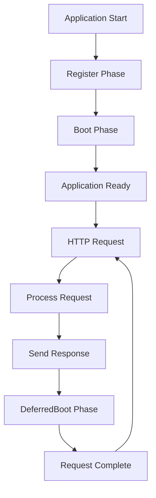

# ServiceProviderDeferred - Tài liệu Kỹ thuật

## Tổng quan

`ServiceProviderDeferred` là interface mở rộng của `ServiceProvider` được thiết kế để hỗ trợ các dịch vụ cần thực hiện deferred boot operations. Interface này đặc biệt hữu ích cho các service cần thực hiện cleanup, flush data, hoặc xử lý async jobs sau khi HTTP request được hoàn thành.

### Vai trò và Mục đích

- **Post-Request Processing**: Thực hiện các tác vụ sau khi HTTP request đã được xử lý xong
- **Non-blocking Operations**: Đảm bảo các tác vụ cleanup không làm chậm response time
- **Resource Management**: Quản lý tài nguyên và cleanup một cách hiệu quả
- **Async Task Processing**: Xử lý các background jobs và async operations
- **Request Lifecycle Extension**: Mở rộng lifecycle của request để thực hiện additional processing

### Khi nào sử dụng ServiceProviderDeferred

ServiceProviderDeferred phù hợp cho các scenarios sau:

- **Logging và Analytics**: Flush log buffers, gửi analytics data
- **Cache Operations**: Update cache, invalidate expired entries
- **Database Cleanup**: Cleanup temporary data, close connections
- **File Operations**: Flush file buffers, cleanup temporary files
- **External API Calls**: Gửi notifications, sync data với external services
- **Background Jobs**: Queue background tasks, trigger async processing

## Architecture và Lifecycle

### Service Provider Lifecycle với Deferred Boot



### Deferred Boot Timing

1. **Register Phase**: Đăng ký services vào container (cùng với ServiceProvider)
2. **Boot Phase**: Khởi tạo services (cùng với ServiceProvider)  
3. **Request Processing**: Xử lý HTTP request bình thường
4. **Response Sent**: Response được gửi về client
5. **DeferredBoot Phase**: Thực hiện deferred operations
6. **Request Lifecycle Complete**: Hoàn thành toàn bộ request lifecycle

## API Reference

### ServiceProviderDeferred Interface

```go
type ServiceProviderDeferred interface {
    ServiceProvider
    DeferredBoot(app Application)
}
```

ServiceProviderDeferred kế thừa tất cả methods từ ServiceProvider:
- `Register(app Application)`
- `Boot(app Application)`
- `Requires() []string`
- `Providers() []string`

Và bổ sung thêm method:

### DeferredBoot

```go
DeferredBoot(app Application)
```

Được gọi sau khi HTTP request được xử lý xong và response đã được gửi về client.

**Mô tả**:
- Thực hiện các post-request operations
- Không ảnh hưởng đến response time của request
- Thích hợp cho cleanup, logging, async processing
- Không nên chứa logic blocking hoặc time-consuming

**Parameters**:
- `app Application`: Application instance với đầy đủ services đã được khởi tạo

**Timing**:
- Được gọi sau khi response đã được gửi về client
- Thực hiện trong background, không block subsequent requests
- Có thể được gọi async hoặc trong separate goroutine

**Error Handling**:
- Có thể panic nếu cleanup operations thất bại
- Errors không ảnh hưởng đến response đã được gửi
- Nên implement graceful error handling để tránh crash application

**Best Practices**:
- Giữ operations nhanh gọn và non-blocking
- Implement timeout cho external calls
- Log errors để debugging
- Avoid heavy computations

**Ví dụ Implementation**:
```go
type LoggingProvider struct {
    buffer    []LogEntry
    batchSize int
    mu        sync.Mutex
}

func (p *LoggingProvider) Register(app Application) {
    container := app.Container()
    
    container.Singleton("logger.deferred", func() interface{} {
        return NewDeferredLogger()
    })
}

func (p *LoggingProvider) Boot(app Application) {
    // Standard boot operations
    container := app.Container()
    logger := container.MustMake("logger.deferred").(DeferredLogger)
    
    // Setup logger configuration
    logger.SetLevel(LogLevelInfo)
}

func (p *LoggingProvider) DeferredBoot(app Application) {
    container := app.Container()
    logger := container.MustMake("logger.deferred").(DeferredLogger)
    
    // Flush log buffer to persistent storage
    if err := logger.Flush(); err != nil {
        log.Printf("Failed to flush logs: %v", err)
        // Don't panic here as response is already sent
    }
    
    // Send logs to external analytics service
    go func() {
        if err := logger.SendToAnalytics(); err != nil {
            log.Printf("Failed to send analytics: %v", err)
        }
    }()
}

func (p *LoggingProvider) Requires() []string {
    return []string{"config"}
}

func (p *LoggingProvider) Providers() []string {
    return []string{"logger.deferred"}
}
```

## Implementation Patterns

### 1. Buffered Logging Provider

```go
type BufferedLoggingProvider struct {
    buffer     []LogEntry
    bufferSize int
    flushChan  chan struct{}
    mu         sync.RWMutex
}

type LogEntry struct {
    Level     LogLevel
    Message   string
    Context   map[string]interface{}
    Timestamp time.Time
    RequestID string
}

func NewBufferedLoggingProvider(bufferSize int) *BufferedLoggingProvider {
    return &BufferedLoggingProvider{
        buffer:     make([]LogEntry, 0, bufferSize),
        bufferSize: bufferSize,
        flushChan:  make(chan struct{}, 1),
    }
}

func (p *BufferedLoggingProvider) Register(app Application) {
    container := app.Container()
    
    container.Singleton("logger.buffered", func() interface{} {
        return &BufferedLogger{
            provider: p,
            buffer:   make([]LogEntry, 0),
        }
    })
}

func (p *BufferedLoggingProvider) Boot(app Application) {
    // Start background flush worker
    go p.flushWorker()
}

func (p *BufferedLoggingProvider) DeferredBoot(app Application) {
    // Add current request logs to buffer
    container := app.Container()
    
    if requestLogger, err := container.Make("request.logger"); err == nil {
        logs := requestLogger.(RequestLogger).GetLogs()
        p.addToBuffer(logs...)
        
        // Trigger flush if buffer is full
        if p.shouldFlush() {
            select {
            case p.flushChan <- struct{}{}:
            default:
                // Flush channel is full, skip this flush
            }
        }
    }
}

func (p *BufferedLoggingProvider) addToBuffer(logs ...LogEntry) {
    p.mu.Lock()
    defer p.mu.Unlock()
    
    p.buffer = append(p.buffer, logs...)
    
    // Prevent buffer from growing too large
    if len(p.buffer) > p.bufferSize*2 {
        // Keep only recent logs
        p.buffer = p.buffer[len(p.buffer)-p.bufferSize:]
    }
}

func (p *BufferedLoggingProvider) shouldFlush() bool {
    p.mu.RLock()
    defer p.mu.RUnlock()
    return len(p.buffer) >= p.bufferSize
}

func (p *BufferedLoggingProvider) flushWorker() {
    ticker := time.NewTicker(30 * time.Second) // Periodic flush
    defer ticker.Stop()
    
    for {
        select {
        case <-p.flushChan:
            p.flush()
        case <-ticker.C:
            p.flush()
        }
    }
}

func (p *BufferedLoggingProvider) flush() {
    p.mu.Lock()
    if len(p.buffer) == 0 {
        p.mu.Unlock()
        return
    }
    
    logsToFlush := make([]LogEntry, len(p.buffer))
    copy(logsToFlush, p.buffer)
    p.buffer = p.buffer[:0] // Clear buffer
    p.mu.Unlock()
    
    // Write logs to persistent storage
    if err := p.writeLogs(logsToFlush); err != nil {
        log.Printf("Failed to flush %d logs: %v", len(logsToFlush), err)
        
        // Re-add logs to buffer for retry
        p.addToBuffer(logsToFlush...)
    }
}

func (p *BufferedLoggingProvider) writeLogs(logs []LogEntry) error {
    // Implementation for writing logs to file/database/external service
    for _, entry := range logs {
        // Write each log entry
        if err := p.writeLogEntry(entry); err != nil {
            return fmt.Errorf("failed to write log entry: %w", err)
        }
    }
    return nil
}

func (p *BufferedLoggingProvider) Requires() []string {
    return []string{"config", "request.logger"}
}

func (p *BufferedLoggingProvider) Providers() []string {
    return []string{"logger.buffered"}
}
```

### 2. Analytics Provider

```go
type AnalyticsProvider struct {
    events      []AnalyticsEvent
    batchSize   int
    apiClient   AnalyticsClient
    rateLimiter *rate.Limiter
    mu          sync.Mutex
}

type AnalyticsEvent struct {
    EventType  string                 `json:"event_type"`
    UserID     string                 `json:"user_id,omitempty"`
    SessionID  string                 `json:"session_id"`
    Properties map[string]interface{} `json:"properties"`
    Timestamp  time.Time              `json:"timestamp"`
}

func NewAnalyticsProvider(apiClient AnalyticsClient) *AnalyticsProvider {
    return &AnalyticsProvider{
        events:      make([]AnalyticsEvent, 0),
        batchSize:   100,
        apiClient:   apiClient,
        rateLimiter: rate.NewLimiter(10, 50), // 10 requests/second, burst 50
    }
}

func (p *AnalyticsProvider) Register(app Application) {
    container := app.Container()
    
    container.Singleton("analytics.tracker", func() interface{} {
        return &AnalyticsTracker{
            provider: p,
        }
    })
    
    container.Singleton("analytics.collector", func() interface{} {
        return &AnalyticsCollector{
            events: make(chan AnalyticsEvent, 1000),
        }
    })
}

func (p *AnalyticsProvider) Boot(app Application) {
    container := app.Container()
    collector := container.MustMake("analytics.collector").(*AnalyticsCollector)
    
    // Start event collection worker
    go p.eventCollectionWorker(collector.events)
}

func (p *AnalyticsProvider) DeferredBoot(app Application) {
    container := app.Container()
    
    // Collect request analytics data
    if requestData, err := container.Make("request.analytics"); err == nil {
        analytics := requestData.(RequestAnalytics)
        
        // Create analytics events for this request
        events := []AnalyticsEvent{
            {
                EventType:  "page_view",
                SessionID:  analytics.SessionID,
                UserID:     analytics.UserID,
                Properties: analytics.PageViewData,
                Timestamp:  time.Now(),
            },
        }
        
        // Add interaction events if any
        for _, interaction := range analytics.Interactions {
            events = append(events, AnalyticsEvent{
                EventType:  "user_interaction",
                SessionID:  analytics.SessionID,
                UserID:     analytics.UserID,
                Properties: interaction,
                Timestamp:  time.Now(),
            })
        }
        
        // Send events to collection worker
        p.addEvents(events...)
    }
}

func (p *AnalyticsProvider) addEvents(events ...AnalyticsEvent) {
    p.mu.Lock()
    defer p.mu.Unlock()
    
    p.events = append(p.events, events...)
    
    // Send batch if we have enough events
    if len(p.events) >= p.batchSize {
        go p.sendBatch()
    }
}

func (p *AnalyticsProvider) sendBatch() {
    p.mu.Lock()
    if len(p.events) == 0 {
        p.mu.Unlock()
        return
    }
    
    batchEvents := make([]AnalyticsEvent, len(p.events))
    copy(batchEvents, p.events)
    p.events = p.events[:0] // Clear events
    p.mu.Unlock()
    
    // Rate limiting
    if !p.rateLimiter.Allow() {
        // Rate limited, re-add events for later
        p.addEvents(batchEvents...)
        return
    }
    
    // Send to analytics service
    ctx, cancel := context.WithTimeout(context.Background(), 10*time.Second)
    defer cancel()
    
    if err := p.apiClient.SendEvents(ctx, batchEvents); err != nil {
        log.Printf("Failed to send analytics batch: %v", err)
        
        // Re-add events for retry (with exponential backoff logic)
        p.addEvents(batchEvents...)
    } else {
        log.Printf("Successfully sent analytics batch of %d events", len(batchEvents))
    }
}

func (p *AnalyticsProvider) eventCollectionWorker(eventChan <-chan AnalyticsEvent) {
    ticker := time.NewTicker(30 * time.Second)
    defer ticker.Stop()
    
    for {
        select {
        case event := <-eventChan:
            p.addEvents(event)
        case <-ticker.C:
            // Periodic batch send
            if len(p.events) > 0 {
                go p.sendBatch()
            }
        }
    }
}

func (p *AnalyticsProvider) Requires() []string {
    return []string{"config", "request.analytics"}
}

func (p *AnalyticsProvider) Providers() []string {
    return []string{"analytics.tracker", "analytics.collector"}
}
```

### 3. Cache Maintenance Provider

```go
type CacheMaintenanceProvider struct {
    cacheManager    CacheManager
    cleanupInterval time.Duration
    maintenanceChan chan MaintenanceTask
}

type MaintenanceTask struct {
    Type      string
    Key       string
    Data      interface{}
    Timestamp time.Time
}

func NewCacheMaintenanceProvider(interval time.Duration) *CacheMaintenanceProvider {
    return &CacheMaintenanceProvider{
        cleanupInterval: interval,
        maintenanceChan: make(chan MaintenanceTask, 500),
    }
}

func (p *CacheMaintenanceProvider) Register(app Application) {
    container := app.Container()
    
    container.Singleton("cache.maintenance", func() interface{} {
        cacheManager := container.MustMake("cache.manager").(CacheManager)
        return &CacheMaintenance{
            manager: cacheManager,
            tasks:   p.maintenanceChan,
        }
    })
}

func (p *CacheMaintenanceProvider) Boot(app Application) {
    container := app.Container()
    p.cacheManager = container.MustMake("cache.manager").(CacheManager)
    
    // Start maintenance worker
    go p.maintenanceWorker()
    
    // Start periodic cleanup
    go p.periodicCleanup()
}

func (p *CacheMaintenanceProvider) DeferredBoot(app Application) {
    container := app.Container()
    
    // Schedule cache operations based on request data
    if requestContext, err := container.Make("request.context"); err == nil {
        ctx := requestContext.(RequestContext)
        
        // Invalidate cache entries that were marked for invalidation
        for _, key := range ctx.CacheInvalidations {
            p.scheduleTask(MaintenanceTask{
                Type:      "invalidate",
                Key:       key,
                Timestamp: time.Now(),
            })
        }
        
        // Update cache with fresh data
        for key, data := range ctx.CacheUpdates {
            p.scheduleTask(MaintenanceTask{
                Type:      "update",
                Key:       key,
                Data:      data,
                Timestamp: time.Now(),
            })
        }
        
        // Warm up cache with related data
        if ctx.ShouldWarmupCache {
            p.scheduleTask(MaintenanceTask{
                Type:      "warmup",
                Key:       ctx.WarmupPattern,
                Timestamp: time.Now(),
            })
        }
    }
}

func (p *CacheMaintenanceProvider) scheduleTask(task MaintenanceTask) {
    select {
    case p.maintenanceChan <- task:
    default:
        log.Printf("Maintenance channel full, dropping task: %+v", task)
    }
}

func (p *CacheMaintenanceProvider) maintenanceWorker() {
    for task := range p.maintenanceChan {
        p.processTask(task)
    }
}

func (p *CacheMaintenanceProvider) processTask(task MaintenanceTask) {
    switch task.Type {
    case "invalidate":
        if err := p.cacheManager.Delete(task.Key); err != nil {
            log.Printf("Failed to invalidate cache key %s: %v", task.Key, err)
        }
        
    case "update":
        if err := p.cacheManager.Set(task.Key, task.Data, time.Hour); err != nil {
            log.Printf("Failed to update cache key %s: %v", task.Key, err)
        }
        
    case "warmup":
        go p.warmupCache(task.Key)
        
    default:
        log.Printf("Unknown maintenance task type: %s", task.Type)
    }
}

func (p *CacheMaintenanceProvider) warmupCache(pattern string) {
    // Implement cache warmup logic based on pattern
    keys := p.generateWarmupKeys(pattern)
    
    for _, key := range keys {
        if data, err := p.loadDataForKey(key); err == nil {
            p.cacheManager.Set(key, data, time.Hour)
        }
    }
}

func (p *CacheMaintenanceProvider) periodicCleanup() {
    ticker := time.NewTicker(p.cleanupInterval)
    defer ticker.Stop()
    
    for range ticker.C {
        // Remove expired entries
        if err := p.cacheManager.CleanupExpired(); err != nil {
            log.Printf("Cache cleanup failed: %v", err)
        }
        
        // Optimize cache structure
        if optimizer, ok := p.cacheManager.(CacheOptimizer); ok {
            if err := optimizer.Optimize(); err != nil {
                log.Printf("Cache optimization failed: %v", err)
            }
        }
    }
}

func (p *CacheMaintenanceProvider) Requires() []string {
    return []string{"cache.manager", "request.context"}
}

func (p *CacheMaintenanceProvider) Providers() []string {
    return []string{"cache.maintenance"}
}
```

### 4. Database Cleanup Provider

```go
type DatabaseCleanupProvider struct {
    connections []DatabaseConnection
    cleanupJobs []CleanupJob
    jobQueue    chan CleanupJob
}

type CleanupJob struct {
    Name        string
    Query       string
    Parameters  map[string]interface{}
    Timeout     time.Duration
    Retries     int
    Priority    int
}

func NewDatabaseCleanupProvider() *DatabaseCleanupProvider {
    return &DatabaseCleanupProvider{
        connections: make([]DatabaseConnection, 0),
        cleanupJobs: make([]CleanupJob, 0),
        jobQueue:    make(chan CleanupJob, 100),
    }
}

func (p *DatabaseCleanupProvider) Register(app Application) {
    container := app.Container()
    
    container.Singleton("db.cleanup", func() interface{} {
        return &DatabaseCleanup{
            provider: p,
            queue:    p.jobQueue,
        }
    })
}

func (p *DatabaseCleanupProvider) Boot(app Application) {
    container := app.Container()
    
    // Get database connections
    if db, err := container.Make("db.connection"); err == nil {
        p.connections = append(p.connections, db.(DatabaseConnection))
    }
    
    if readDb, err := container.Make("db.connection.read"); err == nil {
        p.connections = append(p.connections, readDb.(DatabaseConnection))
    }
    
    // Start cleanup worker
    go p.cleanupWorker()
    
    // Schedule periodic cleanup jobs
    p.schedulePeriodicJobs()
}

func (p *DatabaseCleanupProvider) DeferredBoot(app Application) {
    container := app.Container()
    
    // Schedule cleanup based on request activities
    if requestData, err := container.Make("request.db.operations"); err == nil {
        operations := requestData.(DatabaseOperations)
        
        // Cleanup temporary data created during request
        for _, tempTable := range operations.TempTables {
            p.scheduleCleanupJob(CleanupJob{
                Name:       "cleanup_temp_table",
                Query:      "DROP TABLE IF EXISTS " + tempTable,
                Parameters: map[string]interface{}{},
                Timeout:    30 * time.Second,
                Retries:    3,
                Priority:   1,
            })
        }
        
        // Cleanup expired sessions related to this request
        if operations.SessionCleanupNeeded {
            p.scheduleCleanupJob(CleanupJob{
                Name:       "cleanup_expired_sessions",
                Query:      "DELETE FROM sessions WHERE expires_at < NOW() AND updated_at < ?",
                Parameters: map[string]interface{}{"cutoff": time.Now().Add(-24 * time.Hour)},
                Timeout:    60 * time.Second,
                Retries:    2,
                Priority:   2,
            })
        }
        
        // Update statistics after heavy operations
        if operations.HeavyOperationPerformed {
            p.scheduleCleanupJob(CleanupJob{
                Name:       "update_table_stats",
                Query:      "ANALYZE TABLE " + operations.AffectedTable,
                Parameters: map[string]interface{}{},
                Timeout:    120 * time.Second,
                Retries:    1,
                Priority:   3,
            })
        }
    }
}

func (p *DatabaseCleanupProvider) scheduleCleanupJob(job CleanupJob) {
    select {
    case p.jobQueue <- job:
    default:
        log.Printf("Cleanup job queue full, dropping job: %s", job.Name)
    }
}

func (p *DatabaseCleanupProvider) cleanupWorker() {
    for job := range p.jobQueue {
        p.executeCleanupJob(job)
    }
}

func (p *DatabaseCleanupProvider) executeCleanupJob(job CleanupJob) {
    for attempt := 0; attempt <= job.Retries; attempt++ {
        if err := p.runCleanupQuery(job); err != nil {
            if attempt == job.Retries {
                log.Printf("Cleanup job %s failed after %d attempts: %v", job.Name, attempt+1, err)
            } else {
                log.Printf("Cleanup job %s failed attempt %d: %v, retrying...", job.Name, attempt+1, err)
                time.Sleep(time.Duration(attempt+1) * time.Second) // Exponential backoff
            }
        } else {
            log.Printf("Cleanup job %s completed successfully", job.Name)
            break
        }
    }
}

func (p *DatabaseCleanupProvider) runCleanupQuery(job CleanupJob) error {
    if len(p.connections) == 0 {
        return fmt.Errorf("no database connections available")
    }
    
    // Use first available connection (could implement load balancing)
    db := p.connections[0]
    
    ctx, cancel := context.WithTimeout(context.Background(), job.Timeout)
    defer cancel()
    
    // Execute cleanup query
    result, err := db.ExecContext(ctx, job.Query, job.Parameters)
    if err != nil {
        return fmt.Errorf("query execution failed: %w", err)
    }
    
    if rowsAffected, err := result.RowsAffected(); err == nil {
        log.Printf("Cleanup job %s affected %d rows", job.Name, rowsAffected)
    }
    
    return nil
}

func (p *DatabaseCleanupProvider) schedulePeriodicJobs() {
    // Schedule daily cleanup jobs
    go func() {
        ticker := time.NewTicker(24 * time.Hour)
        defer ticker.Stop()
        
        for range ticker.C {
            dailyJobs := []CleanupJob{
                {
                    Name:       "cleanup_old_logs",
                    Query:      "DELETE FROM logs WHERE created_at < ?",
                    Parameters: map[string]interface{}{"cutoff": time.Now().Add(-30 * 24 * time.Hour)},
                    Timeout:    300 * time.Second,
                    Retries:    2,
                    Priority:   1,
                },
                {
                    Name:       "cleanup_expired_tokens",
                    Query:      "DELETE FROM access_tokens WHERE expires_at < NOW()",
                    Parameters: map[string]interface{}{},
                    Timeout:    60 * time.Second,
                    Retries:    3,
                    Priority:   1,
                },
            }
            
            for _, job := range dailyJobs {
                p.scheduleCleanupJob(job)
            }
        }
    }()
}

func (p *DatabaseCleanupProvider) Requires() []string {
    return []string{"db.connection", "request.db.operations"}
}

func (p *DatabaseCleanupProvider) Providers() []string {
    return []string{"db.cleanup"}
}
```

## Error Handling Strategies

### 1. Graceful Error Recovery

```go
type ResilientDeferredProvider struct {
    fallbackActions []FallbackAction
    errorThreshold  int
    errorCount      int64
    mu              sync.RWMutex
}

type FallbackAction interface {
    Execute(context.Context) error
    CanHandle(error) bool
    Priority() int
}

func (p *ResilientDeferredProvider) DeferredBoot(app Application) {
    defer func() {
        if r := recover(); r != nil {
            log.Printf("DeferredBoot panic recovered: %v", r)
            
            // Try fallback actions
            p.executeFallbackActions(fmt.Errorf("panic: %v", r))
        }
    }()
    
    // Track error count
    atomic.AddInt64(&p.errorCount, 1)
    
    // Check if we're exceeding error threshold
    if atomic.LoadInt64(&p.errorCount) > int64(p.errorThreshold) {
        log.Printf("Error threshold exceeded, switching to fallback mode")
        p.executeFallbackActions(fmt.Errorf("error threshold exceeded"))
        return
    }
    
    // Normal deferred operations
    if err := p.performDeferredOperations(app); err != nil {
        log.Printf("Deferred operations failed: %v", err)
        p.executeFallbackActions(err)
    } else {
        // Reset error count on success
        atomic.StoreInt64(&p.errorCount, 0)
    }
}

func (p *ResilientDeferredProvider) executeFallbackActions(err error) {
    // Sort fallback actions by priority
    sort.Slice(p.fallbackActions, func(i, j int) bool {
        return p.fallbackActions[i].Priority() < p.fallbackActions[j].Priority()
    })
    
    for _, action := range p.fallbackActions {
        if action.CanHandle(err) {
            ctx, cancel := context.WithTimeout(context.Background(), 30*time.Second)
            if execErr := action.Execute(ctx); execErr != nil {
                log.Printf("Fallback action failed: %v", execErr)
            } else {
                log.Printf("Fallback action executed successfully")
                cancel()
                return
            }
            cancel()
        }
    }
    
    log.Printf("All fallback actions failed for error: %v", err)
}
```

### 2. Circuit Breaker Pattern

```go
type CircuitBreakerDeferredProvider struct {
    circuitBreaker *CircuitBreaker
    fallbackFunc   func(app Application) error
}

type CircuitBreaker struct {
    maxFailures int
    timeout     time.Duration
    failures    int
    lastFailure time.Time
    state       CircuitState
    mu          sync.RWMutex
}

type CircuitState int

const (
    CircuitClosed CircuitState = iota
    CircuitOpen
    CircuitHalfOpen
)

func (p *CircuitBreakerDeferredProvider) DeferredBoot(app Application) {
    if !p.circuitBreaker.AllowRequest() {
        log.Printf("Circuit breaker is open, using fallback")
        if p.fallbackFunc != nil {
            p.fallbackFunc(app)
        }
        return
    }
    
    if err := p.performDeferredOperations(app); err != nil {
        p.circuitBreaker.RecordFailure()
        log.Printf("Deferred operation failed: %v", err)
        
        if p.fallbackFunc != nil {
            p.fallbackFunc(app)
        }
    } else {
        p.circuitBreaker.RecordSuccess()
    }
}

func (cb *CircuitBreaker) AllowRequest() bool {
    cb.mu.RLock()
    defer cb.mu.RUnlock()
    
    switch cb.state {
    case CircuitClosed:
        return true
    case CircuitOpen:
        return time.Since(cb.lastFailure) > cb.timeout
    case CircuitHalfOpen:
        return true
    default:
        return false
    }
}

func (cb *CircuitBreaker) RecordSuccess() {
    cb.mu.Lock()
    defer cb.mu.Unlock()
    
    cb.failures = 0
    cb.state = CircuitClosed
}

func (cb *CircuitBreaker) RecordFailure() {
    cb.mu.Lock()
    defer cb.mu.Unlock()
    
    cb.failures++
    cb.lastFailure = time.Now()
    
    if cb.failures >= cb.maxFailures {
        cb.state = CircuitOpen
    }
}
```

## Testing Strategies

### 1. Mock Deferred Provider

```go
type MockDeferredProvider struct {
    RegisterFunc     func(app Application)
    BootFunc         func(app Application)
    DeferredBootFunc func(app Application)
    RequiresFunc     func() []string
    ProvidersFunc    func() []string
    CallLog          []string
}

func (m *MockDeferredProvider) Register(app Application) {
    m.CallLog = append(m.CallLog, "Register")
    if m.RegisterFunc != nil {
        m.RegisterFunc(app)
    }
}

func (m *MockDeferredProvider) Boot(app Application) {
    m.CallLog = append(m.CallLog, "Boot")
    if m.BootFunc != nil {
        m.BootFunc(app)
    }
}

func (m *MockDeferredProvider) DeferredBoot(app Application) {
    m.CallLog = append(m.CallLog, "DeferredBoot")
    if m.DeferredBootFunc != nil {
        m.DeferredBootFunc(app)
    }
}

func (m *MockDeferredProvider) Requires() []string {
    if m.RequiresFunc != nil {
        return m.RequiresFunc()
    }
    return []string{}
}

func (m *MockDeferredProvider) Providers() []string {
    if m.ProvidersFunc != nil {
        return m.ProvidersFunc()
    }
    return []string{}
}

// Test usage
func TestDeferredProvider(t *testing.T) {
    app := NewTestApplication()
    
    mockProvider := &MockDeferredProvider{
        DeferredBootFunc: func(app Application) {
            // Mock deferred operations
            log.Println("Mock deferred boot executed")
        },
    }
    
    app.Register(mockProvider)
    app.Boot()
    
    // Simulate request completion and deferred boot
    app.DeferredBoot()
    
    // Verify call sequence
    expectedCalls := []string{"Register", "Boot", "DeferredBoot"}
    assert.Equal(t, expectedCalls, mockProvider.CallLog)
}
```

### 2. Integration Testing

```go
func TestDeferredProviderIntegration(t *testing.T) {
    app := NewTestApplication()
    
    // Setup test database and buffer
    testDB := setupTestDatabase()
    defer testDB.Close()
    
    // Create real providers
    loggingProvider := NewBufferedLoggingProvider(10)
    analyticsProvider := NewAnalyticsProvider(NewMockAnalyticsClient())
    
    // Register providers
    app.Register(loggingProvider)
    app.Register(analyticsProvider)
    
    // Boot application
    err := app.Boot()
    require.NoError(t, err)
    
    // Simulate request processing
    requestContext := &MockRequestContext{
        LogEntries: []LogEntry{
            {Level: LogLevelInfo, Message: "Test log", Timestamp: time.Now()},
        },
        AnalyticsEvents: []AnalyticsEvent{
            {EventType: "page_view", SessionID: "test-session", Timestamp: time.Now()},
        },
    }
    
    app.Container().Singleton("request.context", func() interface{} {
        return requestContext
    })
    
    // Execute deferred boot
    app.DeferredBoot()
    
    // Wait for async operations to complete
    time.Sleep(100 * time.Millisecond)
    
    // Verify results
    logger := app.MustMake("logger.buffered").(BufferedLogger)
    assert.True(t, logger.HasProcessedLogs())
    
    analytics := app.MustMake("analytics.tracker").(AnalyticsTracker)
    assert.True(t, analytics.HasProcessedEvents())
}
```

### 3. Performance Testing

```go
func BenchmarkDeferredProvider(b *testing.B) {
    app := NewTestApplication()
    provider := NewBufferedLoggingProvider(1000)
    
    app.Register(provider)
    app.Boot()
    
    // Create request context with logs
    requestContext := &MockRequestContext{
        LogEntries: make([]LogEntry, 100), // 100 log entries per request
    }
    
    app.Container().Singleton("request.context", func() interface{} {
        return requestContext
    })
    
    b.ResetTimer()
    
    for i := 0; i < b.N; i++ {
        app.DeferredBoot()
    }
}

func TestDeferredProviderConcurrency(t *testing.T) {
    app := NewTestApplication()
    provider := NewBufferedLoggingProvider(1000)
    
    app.Register(provider)
    app.Boot()
    
    // Simulate concurrent requests
    var wg sync.WaitGroup
    numRequests := 100
    
    for i := 0; i < numRequests; i++ {
        wg.Add(1)
        go func(requestID int) {
            defer wg.Done()
            
            // Create request-specific context
            requestContext := &MockRequestContext{
                RequestID: fmt.Sprintf("req-%d", requestID),
                LogEntries: []LogEntry{
                    {Level: LogLevelInfo, Message: fmt.Sprintf("Log from request %d", requestID)},
                },
            }
            
            app.Container().Singleton(fmt.Sprintf("request.context.%d", requestID), func() interface{} {
                return requestContext
            })
            
            app.DeferredBoot()
        }(i)
    }
    
    wg.Wait()
    
    // Verify no race conditions occurred
    logger := app.MustMake("logger.buffered").(BufferedLogger)
    assert.NoError(t, logger.HealthCheck())
}
```

## Performance Considerations

### 1. Async Processing

```go
type AsyncDeferredProvider struct {
    workerPool chan struct{}
    taskQueue  chan func()
    wg         sync.WaitGroup
}

func NewAsyncDeferredProvider(workers int) *AsyncDeferredProvider {
    return &AsyncDeferredProvider{
        workerPool: make(chan struct{}, workers),
        taskQueue:  make(chan func(), 1000),
    }
}

func (p *AsyncDeferredProvider) Boot(app Application) {
    // Start worker pool
    for i := 0; i < cap(p.workerPool); i++ {
        go p.worker()
    }
}

func (p *AsyncDeferredProvider) DeferredBoot(app Application) {
    // Submit task to worker pool
    select {
    case p.taskQueue <- func() {
        p.performDeferredOperations(app)
    }:
        // Task submitted successfully
    default:
        // Queue is full, execute inline or drop
        log.Printf("Deferred task queue full, executing inline")
        p.performDeferredOperations(app)
    }
}

func (p *AsyncDeferredProvider) worker() {
    for task := range p.taskQueue {
        func() {
            defer func() {
                if r := recover(); r != nil {
                    log.Printf("Worker task panic: %v", r)
                }
            }()
            task()
        }()
    }
}
```

### 2. Batching và Rate Limiting

```go
type BatchedDeferredProvider struct {
    batcher     *Batcher
    rateLimiter *rate.Limiter
}

type Batcher struct {
    items     []interface{}
    batchSize int
    timeout   time.Duration
    mu        sync.Mutex
    timer     *time.Timer
}

func (p *BatchedDeferredProvider) DeferredBoot(app Application) {
    // Check rate limit
    if !p.rateLimiter.Allow() {
        log.Printf("Rate limit exceeded, skipping deferred operation")
        return
    }
    
    // Add to batch
    p.batcher.Add(app)
}

func (b *Batcher) Add(item interface{}) {
    b.mu.Lock()
    defer b.mu.Unlock()
    
    b.items = append(b.items, item)
    
    // Process batch if full
    if len(b.items) >= b.batchSize {
        b.processBatch()
        return
    }
    
    // Reset timer for timeout-based processing
    if b.timer != nil {
        b.timer.Stop()
    }
    
    b.timer = time.AfterFunc(b.timeout, func() {
        b.mu.Lock()
        defer b.mu.Unlock()
        if len(b.items) > 0 {
            b.processBatch()
        }
    })
}

func (b *Batcher) processBatch() {
    if len(b.items) == 0 {
        return
    }
    
    batch := make([]interface{}, len(b.items))
    copy(batch, b.items)
    b.items = b.items[:0] // Clear items
    
    go func() {
        // Process batch asynchronously
        log.Printf("Processing batch of %d items", len(batch))
        // Implement batch processing logic
    }()
}
```

## Best Practices

### 1. Timeout Management

```go
type TimeoutDeferredProvider struct {
    defaultTimeout time.Duration
    operationMap   map[string]time.Duration
}

func (p *TimeoutDeferredProvider) DeferredBoot(app Application) {
    operations := []struct {
        name string
        fn   func(context.Context) error
    }{
        {"flush_logs", p.flushLogs},
        {"send_analytics", p.sendAnalytics},
        {"cleanup_cache", p.cleanupCache},
    }
    
    for _, op := range operations {
        timeout := p.getTimeoutForOperation(op.name)
        
        ctx, cancel := context.WithTimeout(context.Background(), timeout)
        
        go func(name string, fn func(context.Context) error) {
            defer cancel()
            
            if err := fn(ctx); err != nil {
                if errors.Is(err, context.DeadlineExceeded) {
                    log.Printf("Operation %s timed out after %v", name, timeout)
                } else {
                    log.Printf("Operation %s failed: %v", name, err)
                }
            }
        }(op.name, op.fn)
    }
}

func (p *TimeoutDeferredProvider) getTimeoutForOperation(operation string) time.Duration {
    if timeout, exists := p.operationMap[operation]; exists {
        return timeout
    }
    return p.defaultTimeout
}
```

### 2. Resource Management

```go
type ResourceManagedDeferredProvider struct {
    resourcePool   sync.Pool
    activeResources int64
    maxResources   int64
}

func (p *ResourceManagedDeferredProvider) DeferredBoot(app Application) {
    // Check resource availability
    current := atomic.LoadInt64(&p.activeResources)
    if current >= p.maxResources {
        log.Printf("Resource limit reached, skipping deferred operation")
        return
    }
    
    // Get resource from pool
    resource := p.resourcePool.Get()
    if resource == nil {
        resource = p.createNewResource()
    }
    
    atomic.AddInt64(&p.activeResources, 1)
    
    go func() {
        defer func() {
            atomic.AddInt64(&p.activeResources, -1)
            p.resourcePool.Put(resource)
        }()
        
        // Use resource for deferred operations
        p.performOperationsWithResource(resource, app)
    }()
}

func (p *ResourceManagedDeferredProvider) createNewResource() interface{} {
    // Create new resource (connection, buffer, etc.)
    return &Resource{
        ID:        uuid.New().String(),
        CreatedAt: time.Now(),
    }
}
```

### 3. Monitoring và Metrics

```go
type MonitoredDeferredProvider struct {
    metrics DeferredMetrics
}

type DeferredMetrics struct {
    ExecutionCount    int64
    ErrorCount        int64
    TotalDuration     time.Duration
    AverageDuration   time.Duration
    LastExecutionTime time.Time
    mu                sync.RWMutex
}

func (p *MonitoredDeferredProvider) DeferredBoot(app Application) {
    start := time.Now()
    
    defer func() {
        duration := time.Since(start)
        p.updateMetrics(duration, nil)
        
        if r := recover(); r != nil {
            p.updateMetrics(duration, fmt.Errorf("panic: %v", r))
            panic(r) // Re-panic
        }
    }()
    
    if err := p.performDeferredOperations(app); err != nil {
        p.updateMetrics(time.Since(start), err)
        return
    }
}

func (p *MonitoredDeferredProvider) updateMetrics(duration time.Duration, err error) {
    p.metrics.mu.Lock()
    defer p.metrics.mu.Unlock()
    
    p.metrics.ExecutionCount++
    p.metrics.LastExecutionTime = time.Now()
    p.metrics.TotalDuration += duration
    p.metrics.AverageDuration = p.metrics.TotalDuration / time.Duration(p.metrics.ExecutionCount)
    
    if err != nil {
        p.metrics.ErrorCount++
    }
}

func (p *MonitoredDeferredProvider) GetMetrics() DeferredMetrics {
    p.metrics.mu.RLock()
    defer p.metrics.mu.RUnlock()
    
    return DeferredMetrics{
        ExecutionCount:    p.metrics.ExecutionCount,
        ErrorCount:        p.metrics.ErrorCount,
        TotalDuration:     p.metrics.TotalDuration,
        AverageDuration:   p.metrics.AverageDuration,
        LastExecutionTime: p.metrics.LastExecutionTime,
    }
}
```

## Framework Integration

### 1. HTTP Middleware Integration

```go
func DeferredBootMiddleware(deferredProviders []ServiceProviderDeferred) func(http.Handler) http.Handler {
    return func(next http.Handler) http.Handler {
        return http.HandlerFunc(func(w http.ResponseWriter, r *http.Request) {
            // Create response wrapper to capture when response is sent
            wrapper := &responseWrapper{
                ResponseWriter: w,
                deferredFunc: func() {
                    // Execute deferred boot for all providers
                    for _, provider := range deferredProviders {
                        go func(p ServiceProviderDeferred) {
                            defer func() {
                                if r := recover(); r != nil {
                                    log.Printf("Deferred boot panic: %v", r)
                                }
                            }()
                            p.DeferredBoot(getAppFromContext(r.Context()))
                        }(provider)
                    }
                },
            }
            
            // Process request
            next.ServeHTTP(wrapper, r)
            
            // Trigger deferred operations after response is sent
            wrapper.triggerDeferred()
        })
    }
}

type responseWrapper struct {
    http.ResponseWriter
    deferredFunc   func()
    responseSent   bool
    mu             sync.Mutex
}

func (w *responseWrapper) WriteHeader(statusCode int) {
    w.mu.Lock()
    defer w.mu.Unlock()
    
    if !w.responseSent {
        w.ResponseWriter.WriteHeader(statusCode)
        w.responseSent = true
        
        // Schedule deferred execution
        go w.deferredFunc()
    }
}

func (w *responseWrapper) Write(data []byte) (int, error) {
    w.mu.Lock()
    if !w.responseSent {
        w.responseSent = true
        w.mu.Unlock()
        
        // Schedule deferred execution
        go w.deferredFunc()
    } else {
        w.mu.Unlock()
    }
    
    return w.ResponseWriter.Write(data)
}
```

### 2. Application Lifecycle Hooks

```go
type ApplicationWithDeferredBoot struct {
    *BaseApplication
    deferredProviders []ServiceProviderDeferred
}

func (app *ApplicationWithDeferredBoot) HandleRequest(w http.ResponseWriter, r *http.Request) {
    // Normal request handling
    app.BaseApplication.HandleRequest(w, r)
    
    // Execute deferred boot operations
    go app.executeDeferredBoot()
}

func (app *ApplicationWithDeferredBoot) executeDeferredBoot() {
    for _, provider := range app.deferredProviders {
        go func(p ServiceProviderDeferred) {
            defer func() {
                if r := recover(); r != nil {
                    log.Printf("Deferred provider %T panicked: %v", p, r)
                }
            }()
            
            p.DeferredBoot(app)
        }(provider)
    }
}

func (app *ApplicationWithDeferredBoot) Register(provider ServiceProvider) {
    app.BaseApplication.Register(provider)
    
    // Track deferred providers separately
    if deferredProvider, ok := provider.(ServiceProviderDeferred); ok {
        app.deferredProviders = append(app.deferredProviders, deferredProvider)
    }
}
```

## Liên kết

- [Container Documentation](./container.md) - Tài liệu về DI Container
- [Application Documentation](./application.md) - Tài liệu về Application interface
- [Loader Documentation](./loader.md) - Tài liệu về ModuleLoader
- [Provider Documentation](./provider.md) - Tài liệu về ServiceProvider base interface
- [Best Practices Guide](./best-practices.md) - Hướng dẫn best practices (nếu có)

---

*Tài liệu này được tạo tự động dựa trên source code và doctype của `deferred.go`. Vui lòng cập nhật khi có thay đổi trong implementation.*
