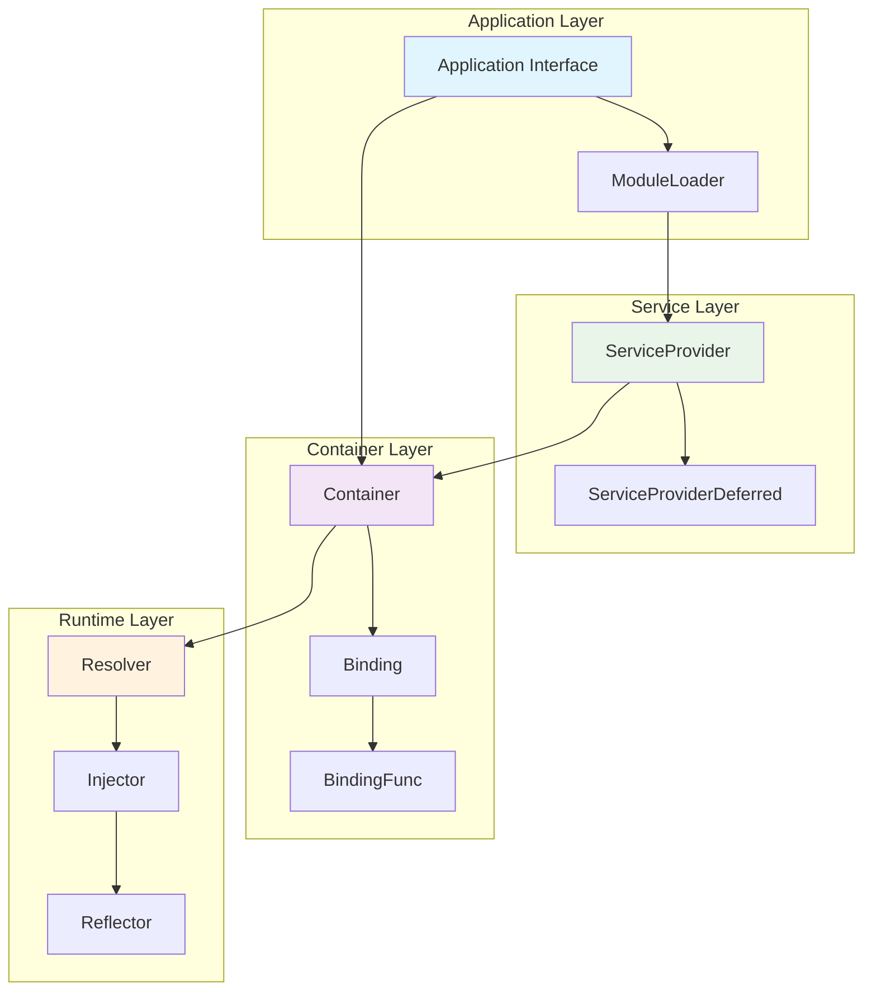
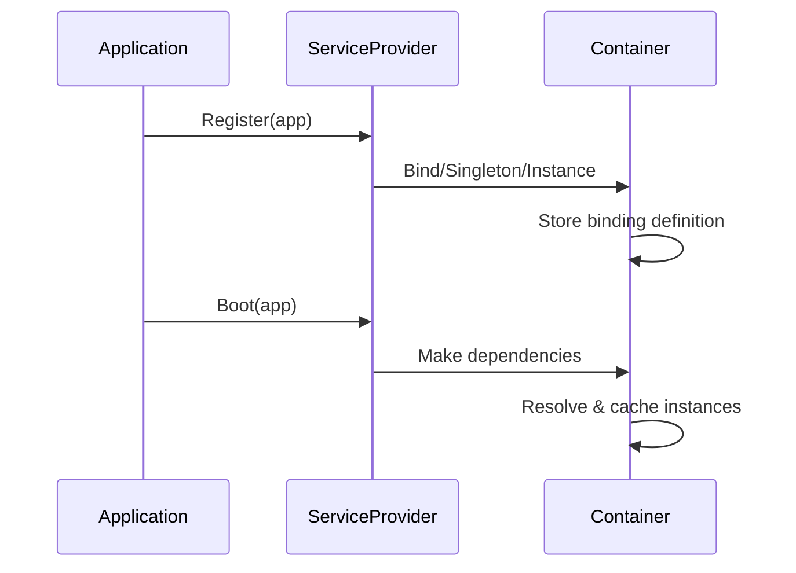
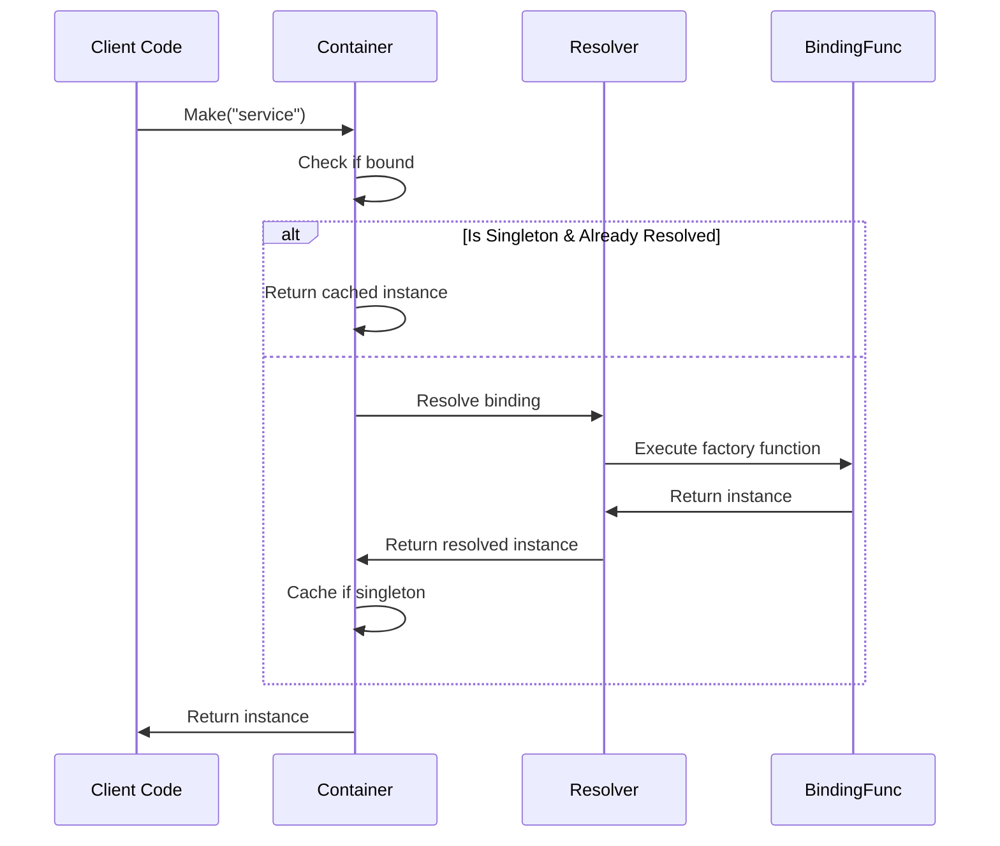
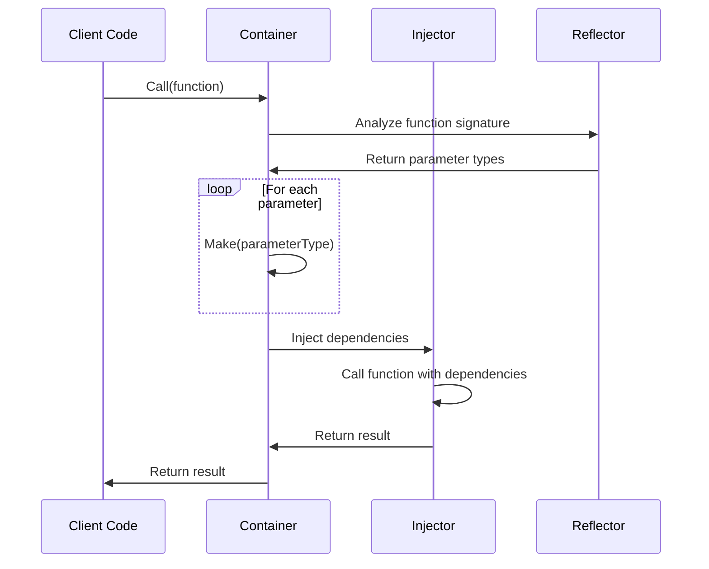

# Tổng quan về Hệ thống Dependency Injection

## Giới thiệu

Hệ thống Dependency Injection (DI) của Fork được thiết kế để cung cấp một kiến trúc mạnh mẽ, linh hoạt và dễ sử dụng cho việc quản lý dependencies trong ứng dụng Go. Hệ thống này lấy cảm hứng từ các framework hiện đại như Laravel, Spring Boot nhưng được tối ưu hóa cho Go language idioms.

## Kiến trúc Cốt lõi

### Design Principles

1. **Inversion of Control (IoC)**: Chuyển quyền kiểm soát việc tạo và quản lý objects cho DI container
2. **Dependency Inversion**: Phụ thuộc vào abstractions (interfaces) thay vì concrete implementations
3. **Single Responsibility**: Mỗi component có một trách nhiệm rõ ràng và cụ thể
4. **Open/Closed Principle**: Mở rộng được nhưng không cần thay đổi code hiện tại

### Core Components



## Component Deep Dive

### 1. Application Interface

**Vai trò**: Contract chuẩn cho ứng dụng sử dụng DI system

**Chức năng chính**:
- Cung cấp access tới DI container
- Quản lý service provider lifecycle
- Điều phối quá trình khởi tạo ứng dụng

**Signature**:
```go
type Application interface {
    Container() ContainerContract
    RegisterProvider(provider ServiceProvider)
    Boot() error
}
```

### 2. Container (ContainerContract)

**Vai trò**: Thành phần cốt lõi quản lý toàn bộ dependencies

**Chức năng chính**:
- **Binding Management**: Đăng ký và quản lý bindings
- **Dependency Resolution**: Resolve dependencies một cách tự động
- **Lifecycle Management**: Quản lý singleton và transient instances
- **Reflection-based Injection**: Auto-injection thông qua reflection

**Key Methods**:
```go
type ContainerContract interface {
    // Binding Registration
    Bind(abstract string, factory BindingFunc) ContainerContract
    Singleton(abstract string, factory BindingFunc) ContainerContract
    Instance(abstract string, instance interface{}) ContainerContract
    Alias(alias string, abstract string) ContainerContract
    
    // Dependency Resolution
    Make(abstract string) (interface{}, error)
    MustMake(abstract string) interface{}
    Call(callable interface{}) (interface{}, error)
    
    // Container Management
    Bound(abstract string) bool
    Reset()
}
```

### 3. ServiceProvider

**Vai trò**: Pattern chuẩn cho việc tổ chức và đăng ký services

**Lifecycle**:
1. **Register Phase**: Đăng ký bindings vào container
2. **Boot Phase**: Khởi tạo và cấu hình services

**Interface**:
```go
type ServiceProvider interface {
    Register(app Application)
    Boot(app Application)
    Requires() []string
    Providers() []string
}
```

**Implementation Pattern**:
```go
type DatabaseProvider struct {
    config *DatabaseConfig
}

func (p *DatabaseProvider) Register(app Application) {
    container := app.Container()
    
    // Đăng ký database connection factory
    container.Singleton("db.connection", func() interface{} {
        return p.createConnection()
    })
    
    // Đăng ký repository interfaces
    container.Bind("user.repository", func() interface{} {
        conn := container.MustMake("db.connection").(Database)
        return NewUserRepository(conn)
    })
}

func (p *DatabaseProvider) Boot(app Application) {
    container := app.Container()
    
    // Thực hiện database migrations
    db := container.MustMake("db.connection").(Database)
    migrator := NewMigrator(db)
    migrator.Run()
}
```

### 4. ServiceProviderDeferred

**Vai trò**: Mở rộng ServiceProvider để hỗ trợ post-request operations

**Use Cases**:
- Cleanup operations
- Background job processing
- Analytics và logging
- Cache maintenance

**Interface**:
```go
type ServiceProviderDeferred interface {
    ServiceProvider
    DeferredBoot(app Application)
}
```

### 5. ModuleLoader

**Vai trò**: Hệ thống dynamic loading cho modules và plugins

**Chức năng**:
- Load modules từ configuration
- Dynamic provider registration
- Plugin architecture support

## Dependency Resolution Flow

### 1. Binding Registration Flow



### 2. Dependency Resolution Flow



### 3. Auto-Injection Flow



## Advanced Features

### 1. Contextual Binding

Binding khác nhau dựa trên context:

```go
// Bind different implementations based on context
container.ContextualBind("EmailService", "NotificationController", func() interface{} {
    return NewSMTPEmailService()
})

container.ContextualBind("EmailService", "MarketingController", func() interface{} {
    return NewMailchimpEmailService()
})
```

### 2. Tagged Services

Nhóm services theo tags:

```go
// Register services with tags
container.Tag("payment.processors", []string{
    "payment.stripe",
    "payment.paypal", 
    "payment.square",
})

// Resolve all tagged services
processors := container.Tagged("payment.processors")
```

### 3. Decorator Pattern

Wrap services với decorators:

```go
container.Decorator("logger", func(service interface{}, container ContainerContract) interface{} {
    logger := service.(Logger)
    return NewTimingDecorator(logger)
})
```

### 4. Factory Pattern với Parameters

```go
container.Factory("cache.driver", func(params map[string]interface{}) interface{} {
    driver := params["driver"].(string)
    
    switch driver {
    case "redis":
        return NewRedisCache(params["config"])
    case "memory":
        return NewMemoryCache(params["size"].(int))
    default:
        return NewFileCache(params["path"].(string))
    }
})
```

## Performance Optimizations

### 1. Lazy Loading

Services chỉ được khởi tạo khi thực sự cần thiết:

```go
// Service chỉ được tạo khi Make() được gọi lần đầu
container.Singleton("expensive.service", func() interface{} {
    return NewExpensiveService() // Chỉ chạy khi cần
})
```

### 2. Singleton Caching

Singleton instances được cache để tránh re-creation:

```go
type Container struct {
    instances map[string]interface{} // Cache cho singletons
    bindings  map[string]*Binding
}
```

### 3. Reflection Caching

Cache reflection metadata để tối ưu performance:

```go
type ReflectionCache struct {
    typeCache     map[reflect.Type]*TypeInfo
    functionCache map[reflect.Value]*FunctionInfo
}
```

### 4. Binding Optimization

Optimize binding resolution với fast paths:

```go
func (c *Container) Make(abstract string) (interface{}, error) {
    // Fast path cho instances
    if instance, exists := c.instances[abstract]; exists {
        return instance, nil
    }
    
    // Fast path cho simple bindings
    if binding := c.bindings[abstract]; binding != nil && binding.IsSimple() {
        return binding.Factory(), nil
    }
    
    // Complex resolution path
    return c.resolve(abstract)
}
```

## Error Handling Strategies

### 1. Binding Errors

```go
type BindingError struct {
    Abstract string
    Message  string
    Cause    error
}

func (e *BindingError) Error() string {
    return fmt.Sprintf("binding error for '%s': %s", e.Abstract, e.Message)
}
```

### 2. Resolution Errors

```go
type ResolutionError struct {
    Abstract    string
    Chain       []string // Dependency chain
    InnerError  error
}
```

### 3. Circular Dependency Detection

```go
type CircularDependencyError struct {
    Chain []string
}

func (c *Container) detectCircularDependency(abstract string, chain []string) bool {
    for _, item := range chain {
        if item == abstract {
            return true
        }
    }
    return false
}
```

## Testing Support

### 1. Mock Container

```go
type MockContainer struct {
    bindings map[string]interface{}
    calls    []string
}

func (m *MockContainer) Make(abstract string) (interface{}, error) {
    m.calls = append(m.calls, abstract)
    return m.bindings[abstract], nil
}
```

### 2. Provider Testing

```go
func TestDatabaseProvider(t *testing.T) {
    // Setup
    container := di.New()
    app := &MockApplication{container: container}
    provider := &DatabaseProvider{}
    
    // Test Register phase
    provider.Register(app)
    assert.True(t, container.Bound("db.connection"))
    
    // Test Boot phase
    provider.Boot(app)
    db := container.MustMake("db.connection")
    assert.NotNil(t, db)
}
```

### 3. Integration Testing

```go
func TestFullApplicationFlow(t *testing.T) {
    app := NewApplication()
    
    // Register providers
    app.RegisterProvider(&DatabaseProvider{})
    app.RegisterProvider(&CacheProvider{})
    app.RegisterProvider(&LoggerProvider{})
    
    // Boot application
    err := app.Boot()
    assert.NoError(t, err)
    
    // Test dependency resolution
    container := app.Container()
    service := container.MustMake("user.service")
    assert.NotNil(t, service)
}
```

## Best Practices

### 1. Provider Organization

- **Single Responsibility**: Mỗi provider chỉ quản lý một domain
- **Clear Dependencies**: Khai báo dependencies rõ ràng
- **Proper Naming**: Sử dụng naming conventions nhất quán

### 2. Binding Strategies

- **Use Interfaces**: Bind interfaces thay vì concrete types
- **Singleton for Stateless**: Singletons cho stateless services
- **Transient for Stateful**: Transient bindings cho stateful objects

### 3. Error Handling

- **Graceful Degradation**: Handle missing dependencies gracefully
- **Clear Error Messages**: Provide contextual error information
- **Fail Fast**: Detect configuration errors early

### 4. Performance

- **Minimize Reflection**: Cache reflection metadata
- **Lazy Loading**: Use lazy loading for expensive services
- **Profile Regularly**: Monitor container performance

## Migration Strategies

### 1. From Manual DI

```go
// Before: Manual dependency injection
func NewUserService() *UserService {
    db := NewDatabase()
    logger := NewLogger()
    cache := NewCache()
    return &UserService{db: db, logger: logger, cache: cache}
}

// After: Container-based injection
func NewUserService(db Database, logger Logger, cache Cache) *UserService {
    return &UserService{db: db, logger: logger, cache: cache}
}

// Register in provider
container.Bind("user.service", func() interface{} {
    return container.Call(NewUserService)
})
```

### 2. Gradual Migration

1. **Introduce Container**: Bắt đầu với container cho new components
2. **Migrate Core Services**: Di chuyển core services sang container
3. **Update Dependencies**: Cập nhật existing code sử dụng container
4. **Remove Manual DI**: Loại bỏ manual dependency injection code

## Troubleshooting Guide

### 1. Common Issues

**Circular Dependencies**:
```go
// Problem: A depends on B, B depends on A
// Solution: Use provider dependencies và interfaces
```

**Missing Bindings**:
```go
// Problem: Service not registered
// Solution: Check provider registration order
if !container.Bound("service") {
    log.Fatal("Service not registered")
}
```

**Memory Leaks**:
```go
// Problem: Singleton services not cleaned up
// Solution: Implement proper cleanup in deferred providers
```

### 2. Debug Tools

**Binding Inspection**:
```go
bindings := container.GetBindings()
for abstract, binding := range bindings {
    fmt.Printf("Bound: %s -> %T\n", abstract, binding)
}
```

**Dependency Tracing**:
```go
container.EnableTracing()
service := container.Make("complex.service")
trace := container.GetTrace()
```

---

*Tài liệu này cung cấp một cái nhìn tổng quan về hệ thống Dependency Injection của Fork. Để biết thêm chi tiết về từng component, vui lòng tham khảo các tài liệu chuyên môn tương ứng.*
